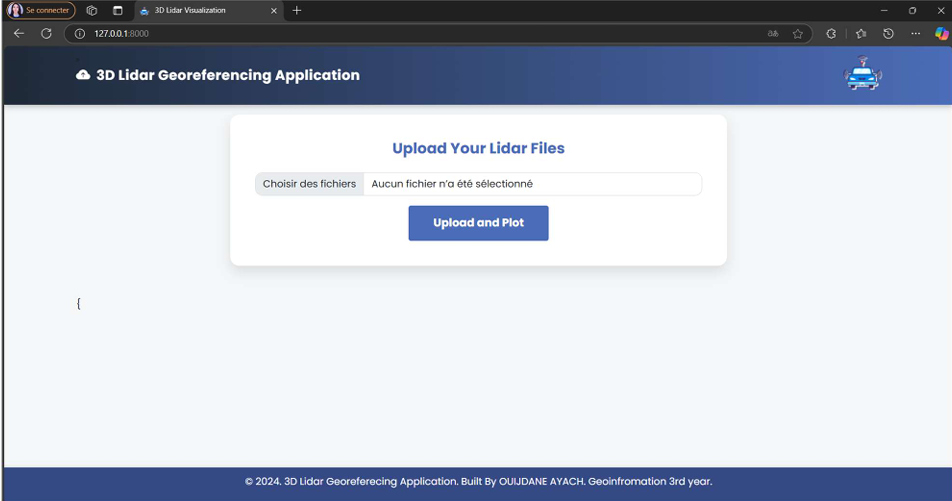
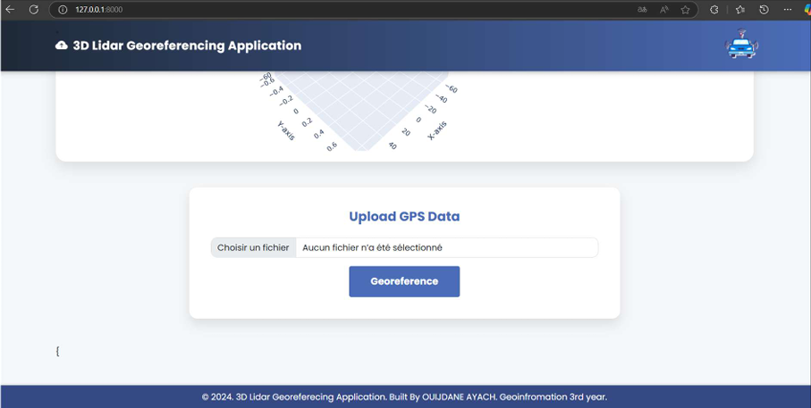
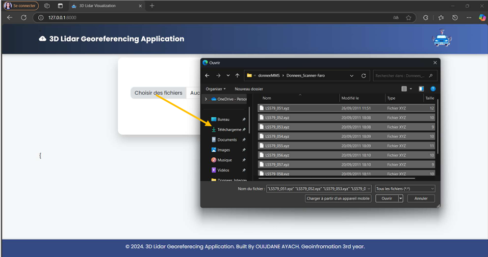
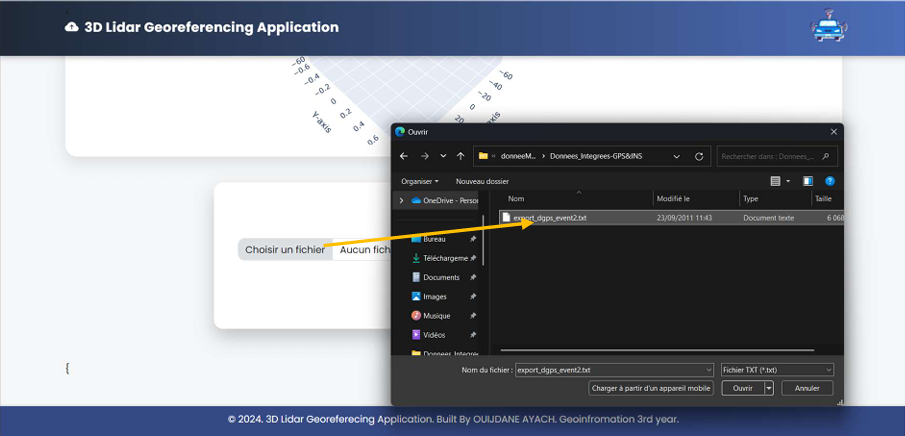
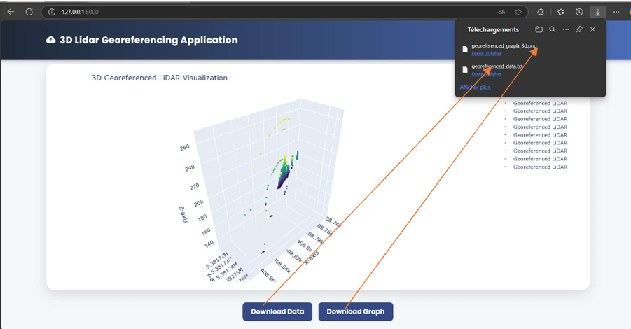
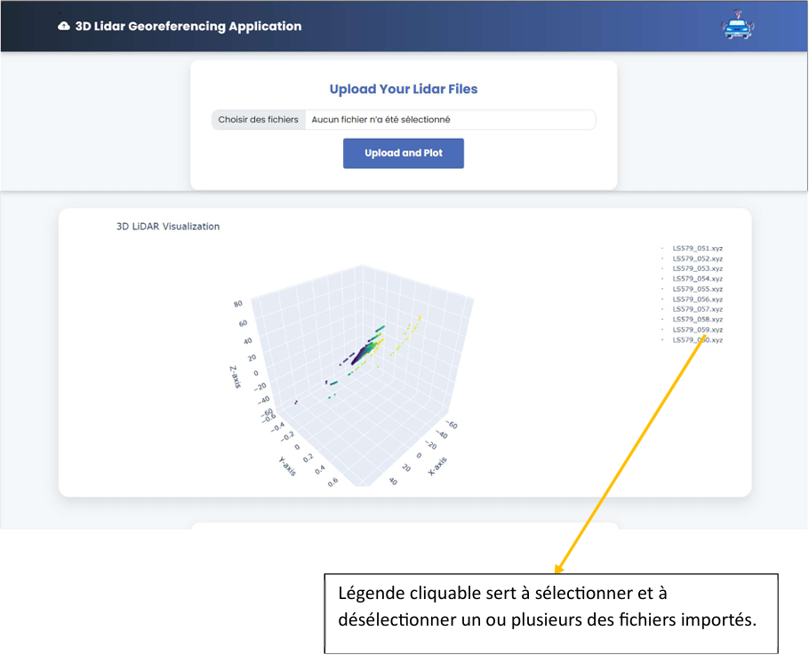
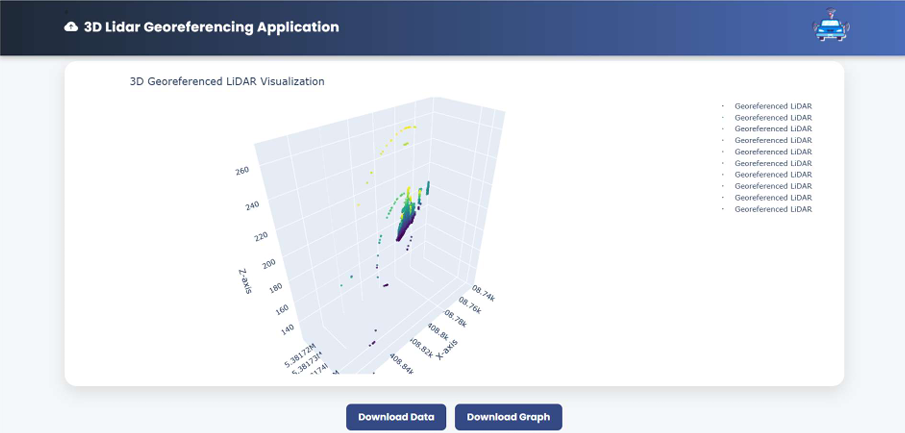

# 📡 Point-clouds-Lidar-Georeferencing  

🔍 **Project for the development of a web application using Python (Django) for the management and 3D visualization of LiDAR data.**  
This application supports **LiDAR and GPS file processing, data georeferencing, and an interactive user interface.**  

---

## 🎥 **Demo Video**
➡️ [Watch the demonstration video](https://drive.google.com/file/d/1-CVfprYVqvV0LS8xYku3AKEl9Fhc4Aeg/view?usp=sharing)
 

---

## 📸 **Project Screenshots**

## 📸 **Project Screenshots**

### 1️⃣ Main Interface


### 2️⃣ Import GPS Data


### 3️⃣ Import Data from Faro Scanner


### 4️⃣ Interface for Importing GPS Data


### 5️⃣ Download Data Files and the Georeferenced LiDAR Graph


### 6️⃣ View Raw Point Cloud


### 7️⃣ View Georeferenced Point Cloud



## 🚀 **Features**  

✅ **3D Visualization of LiDAR Data** – Interactive display of LiDAR point clouds.  
✅ **Georeferencing System** – Processing and aligning GPS and LiDAR data.  
✅ **User-friendly Web Interface** – Built with **Django** for seamless navigation.  
✅ **Efficient File Handling** – Supports multiple **LiDAR (.las, .laz)** and **GPS formats**.   
✅ **Scalability** – Easily extendable for further GIS functionalities.  

---

## 🛠️ **Installation Guide**  

### **1️⃣ Clone the Repository**  
```sh
git clone https://github.com/OuijdaneAyach/Point-clouds-Lidar-Georeferencing.git
cd Point-clouds-Lidar-Georeferencing
